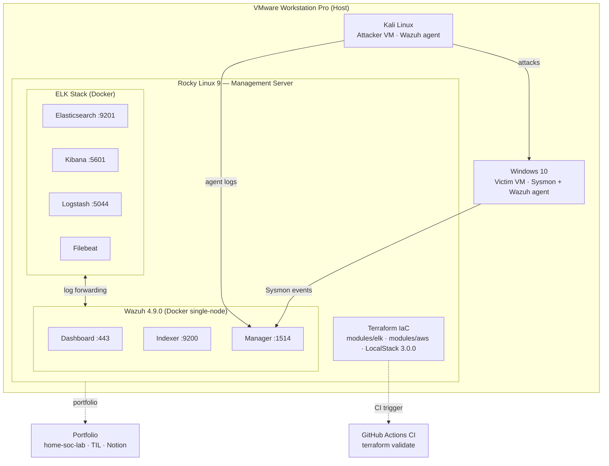

# Home SOC Lab

   

A home SOC environment built from scratch — threat detection rules, active response, and IaC automation targeting a cloud security career.

---

## Architecture



---

## Detection Scenarios

### T1046 — Network Service Scanning (Nmap)
- **Attack**: Nmap port scan from Kali → Rocky
- **Detection**: Wazuh custom rule on multiple connection attempts in short window
- **Validation**: Alert triggered and visible on Kibana SOC dashboard

### T1190 — Exploit Public-Facing Application (SQL Injection)
- **Attack**: SQLi payloads via curl from Kali → Apache on Rocky
- **Detection**: Custom rule 100005 — 5+ SQLi attempts from same IP within 60s → level 12 alert
- **Response**: Active Response blocks attacker IP via iptables (timeout 300s)
- **Validation**: Kali re-attack blocked, iptables rule confirmed

### T1110 — Brute Force (SSH)
- **Attack**: Hydra SSH brute-force from Kali → Rocky
- **Detection**: Rule chaining — 5+ failed logins within 60s → escalated alert
- **Response**: Active Response iptables block
- **Validation**: Block confirmed, subsequent connections dropped

### T1547 — Boot or Logon Autostart Execution (Persistence)
- **Attack**: Registry Run key modification on Windows 10
- **Detection**: FIM (File Integrity Monitoring) — successful; Sysmon EventID 13 rule — in progress
- **Status**: Partial ✅

---

## Stack

| Layer | Technology | Detail |
|-------|-----------|--------|
| Virtualization | VMware Workstation Pro | 3-VM setup |
| Management OS | Rocky Linux 9 | RHEL-aligned, Docker host |
| Attacker VM | Kali Linux | Nmap, Hydra, SQLi |
| Victim VM | Windows 10 | Sysmon + Wazuh agent |
| SIEM | Wazuh 4.9.0 | Single-node Docker |
| Log platform | ELK Stack | ES 9201 / Kibana 5601 / Logstash 5044 |
| Log shipper | Filebeat | Rocky → Logstash |
| IaC | Terraform | Docker provider + AWS module (LocalStack) |
| CI | GitHub Actions | `terraform validate` on push |

---

## IaC Structure

```
terraform-soc/
├── .github/workflows/terraform.yml   # CI: terraform validate
├── main.tf                           # provider + module calls
└── modules/
    ├── elk/                          # Elasticsearch + Kibana containers
    └── aws/                          # VPC + SG + EC2 (LocalStack)
```

→ [terraform-soc repo](https://github.com/zeldaim/terraform-soc)

---

## Key Troubleshooting

| Problem | Root Cause | Fix |
|---------|-----------|-----|
| Wazuh rule level 0 blocking child rules | level 0 = suppress | `overwrite="yes"` + raise level |
| `docker cp` → Permission denied | Copied as root | `chown wazuh:wazuh` + `chmod 660` |
| Docker volume config reset on restart | Modified inside container | Edit host-side volume source directly |
| `.terraform/` exceeded GitHub size limit | Provider binary >100MB | `.gitignore` + `git filter-branch` |
| LocalStack latest version paywalled | Business model change | Pin to 3.0.0 |
| GitHub Actions PAT missing scope | Token lacked `workflow` permission | Re-issue token with `workflow` checked |

---

## Demo

[](https://youtu.be/oV8DtGnOx90)

> Wazuh detection demo — T1046 real-time alert / T1110 results

---

## Resume Summary

> Built a home SOC lab from scratch using Wazuh 4.9.0 + ELK on Rocky Linux 9 (Docker); authored MITRE ATT&CK-mapped detection rules (T1046/T1190/T1110) with active response automation; provisioned the full stack via Terraform with GitHub Actions CI.

---

## Roadmap

- [ ] Week 5 — portfolio documentation + Kibana dashboard recording
- [ ] Week 6 — red team scenario chaining (Metasploit, ATT&CK Navigator)
- [ ] Week 7 — data engineering pipeline (MySQL, statistical reporting)
- [ ] Week 8 — ML-based anomaly detection (Isolation Forest)
- [ ] Week 9 — AWS cloud expansion (GuardDuty, Lambda auto-response)

---

## Related Repos

| Repo | Purpose |
|------|---------|
| [TIL](https://github.com/zeldaim/TIL) | Daily learning notes |
| [terraform-soc](https://github.com/zeldaim/terraform-soc) | Terraform IaC code |
